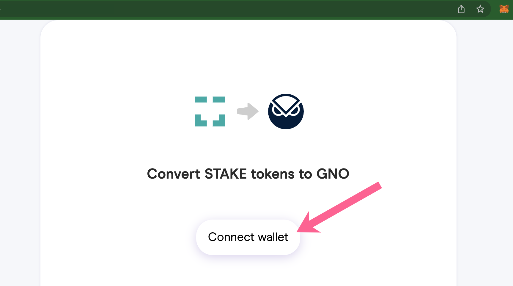
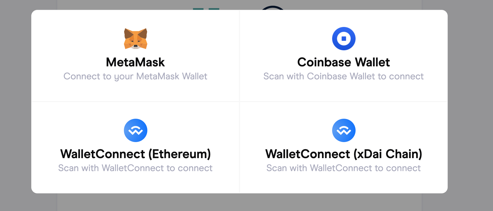
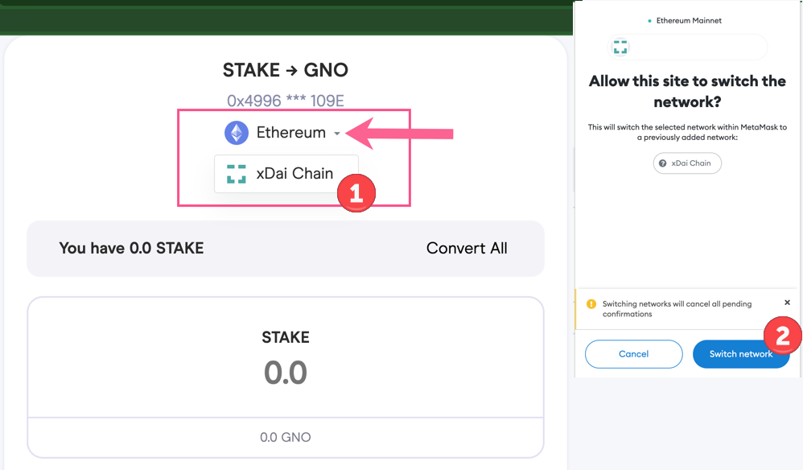
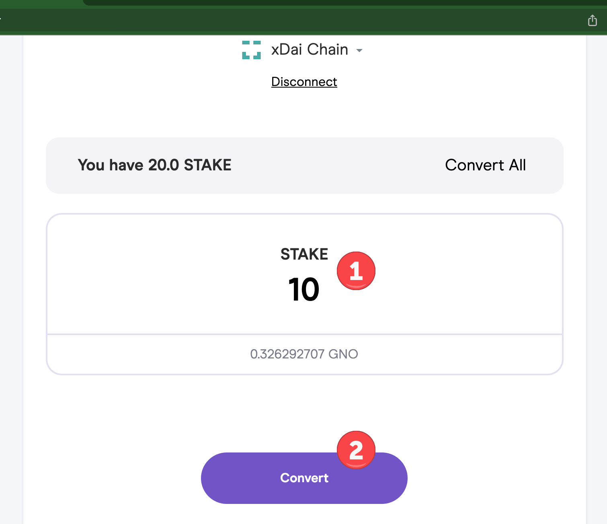
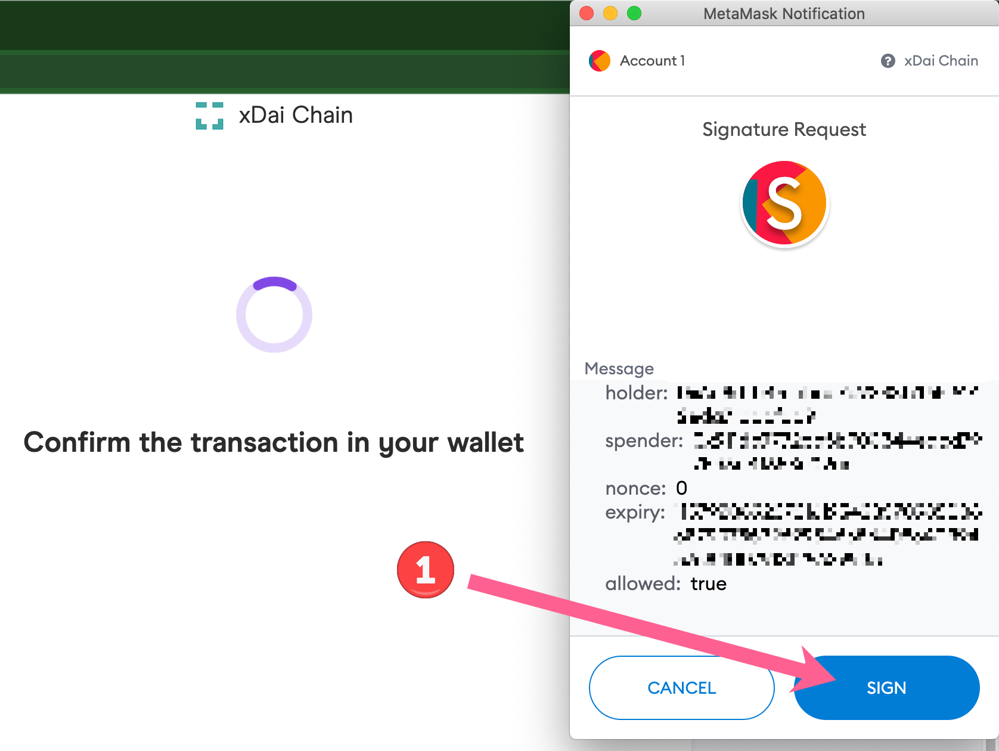
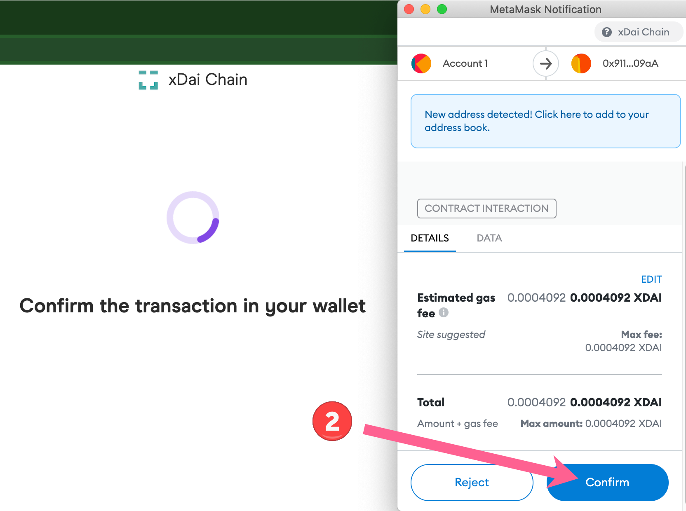

# STAKE / GNO Swap


Live link will be added when swap is active, scheduled to start 11 December, 2021.


## Details

* Swap opens Saturday, December 11. Time TBD.
* Swap rate is fixed at 1 STAKE to 0.0326292707 GNO
* Tokens can be swapped on the xDai Chain (soon to be Gnosis Chain) or the Ethereum Mainnet.&#x20;
* GNO Auction begins Dec 11 designating up to 20k ETH to purchase GNO. This guarantees that GNO trades at at least 0.12 ETH (thus 0.12 \* 0.0326292707 = 0.003915512484). Achieving a minimum STAKE/ETH ratio of 0.003915512484.
* Auction begins Dec 11 time TBD and ends on Dec 20th 3pm CET.
* For more information, see the [Gnosis proposal and amendments](https://forum.gnosis.io/t/gip-16-gnosis-chain-xdai-gnosis-merge/1904).


**Note that the minimum Stake/ETH ratio of 0.003915512484 is only guaranteed through the end the auction (Dec 20)**.&#x20;

Following the auction, this rate is no longer guaranteed.


## Instructions

STAKE is available to swap with GNO on either the xDai Network (soon to be named Gnosis Chain) or the Ethereum Network. Instructions are similar for both Networks, you will connect your Wallet to the network you are swapping on, then proceed with the swap.&#x20;

You will need an amount of ETH  (when swapping on Ethereum) or xDai (when swapping on xDai) to pay gas fees and complete the swap.


Instructions below are for swapping on the xDai chain ([STAKE from Ethereum](https://blockscout.com/xdai/mainnet/token/0xb7D311E2Eb55F2f68a9440da38e7989210b9A05e/token-transfers) to [GNO from Ethereum](https://blockscout.com/xdai/mainnet/token/0x9C58BAcC331c9aa871AFD802DB6379a98e80CEdb/token-transfers)). To swap STAKE on the Ethereum chain, connect your wallet to Ethereum and follow the same process.


## 1. Swap STAKE to GNO on xDai

### 1) Go to swap application at \<coming soon>

Press Connect wallet.

### 2) Select your wallet application of choice.

In this example we use MetaMask connected to the xDai Chain. Note you must have MetaMask enabled in your extensions to see this option.

### 3) Select xDai chain from the dropdown menu.

If using on Ethereum and connected to xDai, use the same dropdown to switch between chains. STAKE values will be shown for the chain you are connected to.

### 4) Enter the amount you want to swap

Click **Convert All** to exchange all. After entering an amount, click Confirm to proceed.

You will need a small amount of xDai to process the transaction. If needed, you can get some at the community faucet at [https://xdai-app.herokuapp.com/faucet](https://xdai-app.herokuapp.com/faucet)

### 5) Confirm Transactions in MetaMask.

First transaction for signature request, 2nd to confirm the transfer.

### 6) Transaction is initiated and should be completed shortly.


Note: If swapping on xDai and you want to send GNO to an exchange, it is vital to bridge GNO to Ethereum first using the [Omnibridge](https://omni.xdaichain.com/bridge). If you send GNO on xDai directly to an exchange address, your tokens WILL BE LOST.


From this final screen you can:

1. Check Transaction Details: Click to view In BlockScout (xDai) or Etherscan (Ethereum).
2. Add GNO to MetaMask: Click to add GNO token to your MetaMask wallet.

.png>)

### Resources

GNO to STAKE Swap Contract on xDai: \
_\<coming soon>_

GNO Address on xDai:\

STAKE Address on xDai: [https://blockscout.com/xdai/mainnet/token/0xb7D311E2Eb55F2f68a9440da38e7989210b9A05e/token-transfers](https://blockscout.com/xdai/mainnet/token/0xb7D311E2Eb55F2f68a9440da38e7989210b9A05e/token-transfers)

