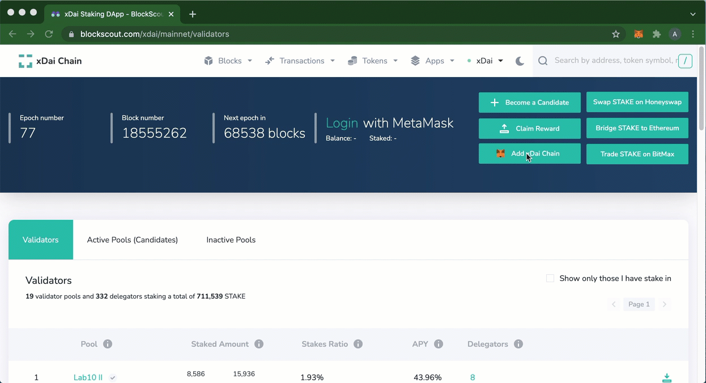
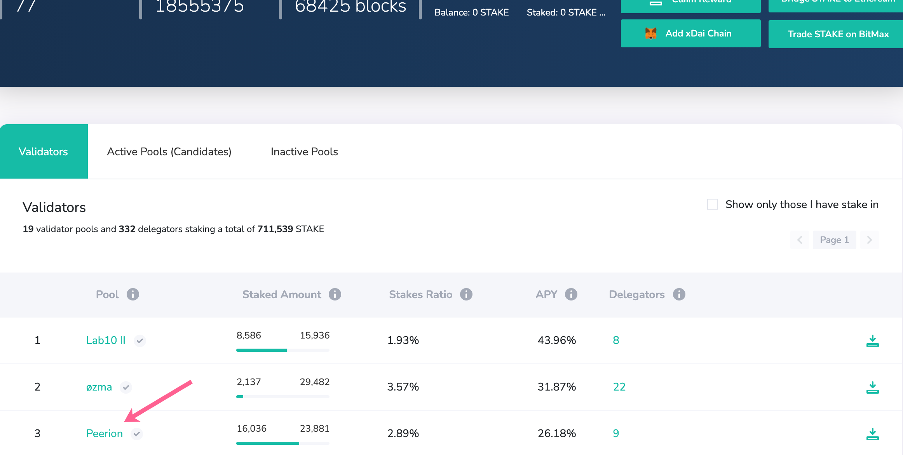
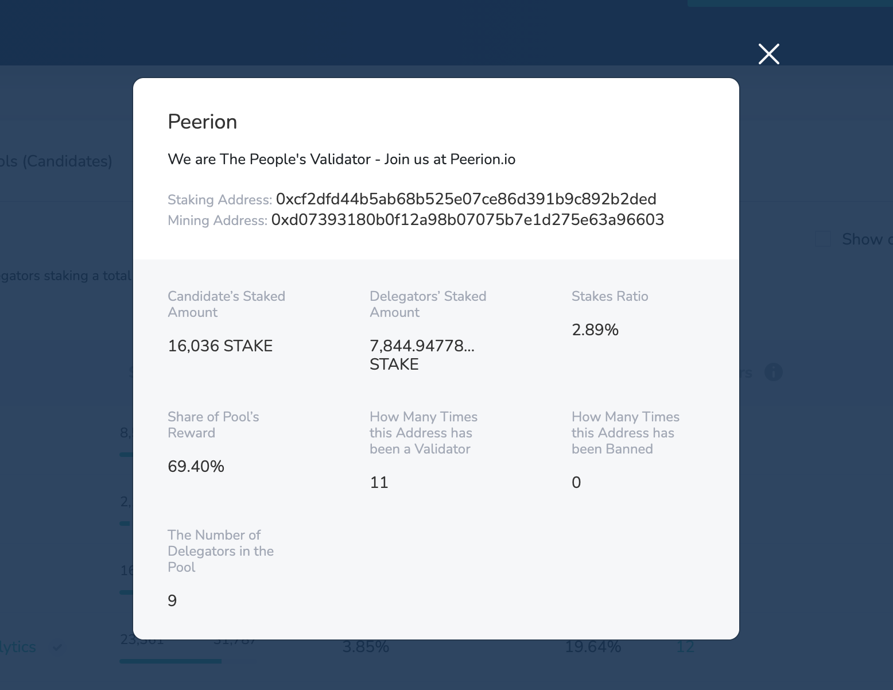
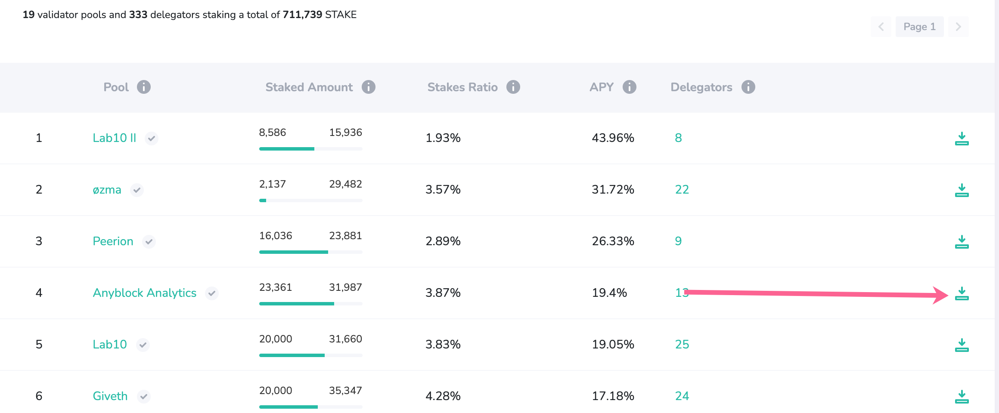
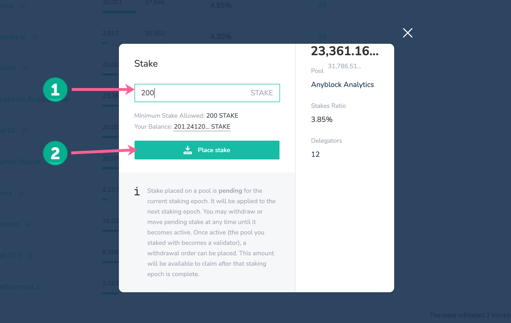
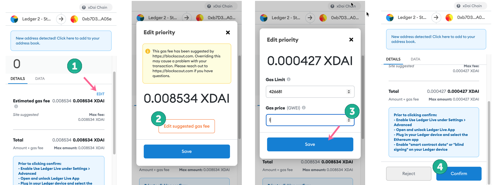
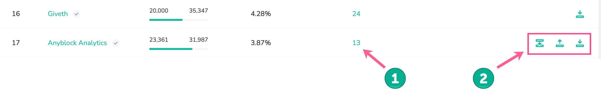

# Become a Delegator

Delegators play an important role in securing the network. By placing stake on candidates, delegators provide additional funds which improve a candidate’s likelihood of becoming a validator. Stake can be thought of as a “vote” in the form of STAKE tokens for a candidate.


If you are interested in becoming a Validator candidate and have the required technical ability to run a node, see the [Become a Candidate](become-a-candidate-validator.md) page.


Delegators can place stake on multiple candidates, move stake between active candidates, and order stake withdrawals during a staking epoch. Block rewards for delegators are based on the percentage of stake they place in the pool.&#x20;

While each validator pool receives the same reward during a staking epoch, rewards within a pool are split between the validators and delegators. This split is based on how much STAKE a delegator has placed relative to the total pool stake. The reward percent is updated each staking epoch in the Delegator modal, which is accessed by pressing on the number of Delegators for any Pool.

To start you will need **200 STAKE on xDai.** See below for instructions on how to get STAKE and move it to the xDai chain.

## Quick Start from Stakefish

If you already have xDai and STAKE, watch this video to get staking right away!


Tutorial from Stakefish


## **Delegating STAKE**


Delegate STAKE using BlockScout (made on v1 interface, processes are the same)


### 1) Get xDai and STAKE

You will need the minimum delegator stake amount of STAKE ([currently 200 STAKE](https://snapshot.page/#/xdaistake.eth/proposal/QmW87yvqQ64t97wj4woee1dBtX1uQSeED8pCqoW2yk5qWs)) and a small amount of xDAI (0.1 is plenty) deposited to your address on the xDai chain.

* [Get xDai](../../for-users/getting-started-with-xdai.md#2-get-a-little-xdai)
* Get [STAKE on xDai](../stake-token/get-stake/)
  1.  Get STAKE on Ethereum and bridge to xDai with OmniBridge: [Move Stake from Ethereum to xDai with the OmniBridge](https://youtu.be/qbuBqur9lcE).&#x20;

      1Hive also offers [easy-to-follow bridging tutorials](https://honeyswap.org/xdai-bridges).
  2. Purchase STAKE on xDai directly with [Honeyswap](https://honeyswap.org/#/swap), [SushiSwap](https://app.sushi.com/swap), [Swapr](https://swapr.eth.link/#/swap) or other xDai DEX options.&#x20;

### 2) Access Staking on BlockScout

Go to [https://blockscout.com/xdai/mainnet/](https://blockscout.com/xdai/mainnet/). Press the 1)Apps dropdown -> 2)Staking on xDai to access the staking application.

### 3) Connect your Wallet&#x20;

Press the** 🦊Add xDai Chain** button and approve the xDai network. Press **Login** to connect to the application. Make sure you are connecting your address containing STAKE and xDai.

Once connected, you should see your address and STAKE balance in the site banner.

### 4) Find a Candidate Pool

View the current validator pools on the **Validators **tab, and** **all active pools (eligible pools which may or may not be validators in the current round) in the **Active Pools (Candidates) **tab.&#x20;

Select the name of the pool to see current pool statistics to help guide your decision.&#x20;

Staking into a candidate with a smaller pool size can result in higher reward percentages, however, candidates with smaller pools have a lower likelihood of selection to the validator set (assuming 20+ active pools).

### 5) Initiate Staking

Once decided, press the **stake icon** next to the pool you would like to stake on.

Enter the 1) STAKE amount to stake (minimum is 200) and press the 2) **Place Stake** button to submit your transaction.

Confirm in MetaMask. Transaction fees do not need to change, but you can edit the default if you'd like. Press **Submit** to process.

To edit the default gas price in MetaMask:

1. Press **Edit** in the Details tab.
2. Press **Edit suggested gas fee**.
3. Change the Gas price (1 Gwei will likely work, if you are unsure check the [xDai Gas Price Oracle](../../for-developers/developer-resources/gas-price-oracle.md))
4. **Confirm** the transaction.

Wait a moment for successful processing. Once confirmed, you will see the Success modal. Press OK.

.png>)

### 6) View your Stake

Your stake will be added to the pool. **It will not be activated until the next staking epoch**. This means you can [move](staking-operations/move-stake.md) or [withdraw](staking-operations/withdraw-stake.md) your stake freely until the staking window closes, which occurs at the end of the current staking epoch (the final 4,332 blocks).

1. Press the value in the number of validators column to learn more about the delegators. Your delegator is designated by the ME tag.
2. You can move, withdraw or deposit additional STAKE while your stake is pending.

### 7) Wait for the Next Epoch

If the pool you delegate to is not selected to the next validator set, you can move, withdraw, or keep your stake within the same pool. There are no restrictions if your pool is not selected.

If your pool is selected as a validator during the next staking epoch, your STAKE will be locked and begin to accrue rewards. Rewards can be claimed after the end of the epoch using the [**Claim Reward** feature.](staking-operations/claim-stake.md)

While your delegation stake is in use by a current validator pool, it cannot be withdrawn immediately. However, you can:

1.  **Add Additional Stake**: Any additional stake added during an epoch will not accrue rewards for the current epoch, but will be added to the pool size which will influence selection in the next epoch. If the pool is chosen as a validator again, this added stake will be included in the next epoch’s rewards calculations.\

    ****:gem: **Instructions** To add additional stake on a candidate or validator, press the stake icon and enter the additional amount. You can add in any increment, as long as the total stake is more than a minimal required amount. Follow the web3 wallet prompts to complete the transaction. [More Info](staking-operations/add-stake.md)\

2.  **Order Stake for Withdrawal**. You may order a withdrawal of your stake, which will be available after the current epoch ends. Ordering a withdrawal will also influence total pool size for the next epoch’s selection process.To order a withdrawal, press the withdrawal icon and enter the amount to order. You must either keep the minimum delegation stake amount OR order the entire amount for withdrawal. You cannot have an amount below the minimum, but you may withdraw your total amount.\

    ****:gem: **Instructions** Enter the amount and press **Order Withdrawal**. You can enter the whole amount to remove yourself as a delegator, or you can remove a portion as long as you maintain a minimum of 1000 STAKE.The transaction should process through the web3 wallet interface. Once the staking epoch is complete, the amount will be available to claim. Press the claim icon and follow the instructions. [More Info](staking-operations/withdraw-stake.md#ordered-withdrawal)
