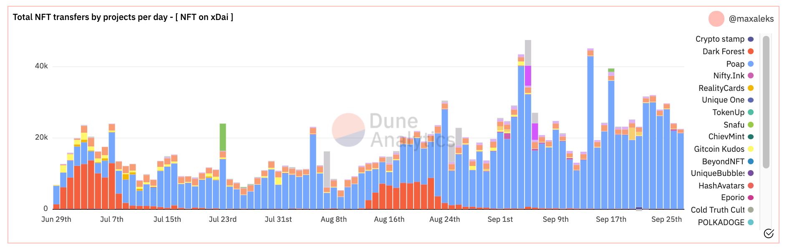
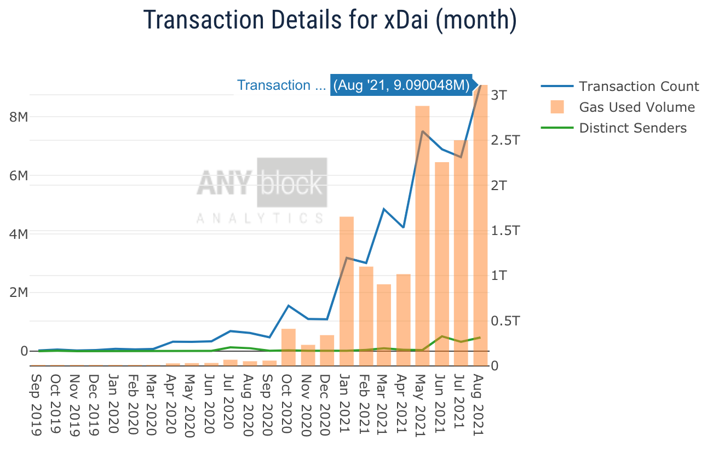

# Analytics Dashboards

A variety of dashboards are available for viewing xDai network usage. For basic, real-time data and insights see [BlockScout Block Explorer](https://blockscout.com/poa/xdai).

## Dune Analytics

If you are interested in development or extending dune analytics for xDai, the [Dune Analytics page](../../for-developers/developer-resources/dune-analytics.md) in the For Developers section is for you🙂

### xDai Staking Dashboard

* Includes statistics from EasyStaking on Ethereum and POSDAO staking on xDai
* Link: [https://www.duneanalytics.com/maxaleks/xdai-staking](https://www.duneanalytics.com/maxaleks/xdai-staking)

### xDai Chain Usage Dashboard

* Total Txs per day, transactions by project and active accounts. Includes info on transaction costs broken down by project.
* Link: [https://duneanalytics.com/maxaleks/xDai-Usage](https://duneanalytics.com/maxaleks/xDai-Usage)

### NFTs on xDai Dashboard

* Volume, transfers, accounts and projects
* Link: [https://dune.xyz/maxaleks/NFT-on-xDai](https://dune.xyz/maxaleks/NFT-on-xDai)

## AnyBlock Analytics

AnyBlock Analytics provides dashboards to assess and compare different metrics on xDai.

* [Network Stats](http://bit.ly/networkxdai)
* [Token & Token Comparisons](http://bit.ly/tokenxdai)
* [Gas Stats](http://%20bit.ly/xdaigas1%C2%A0)

## Dapp Query Dashboards

Track metrics and dashboards of popular xDai Dapps on the xDai explorer: [https://dappquery.com/category/xdai](https://dappquery.com/category/xdai)

