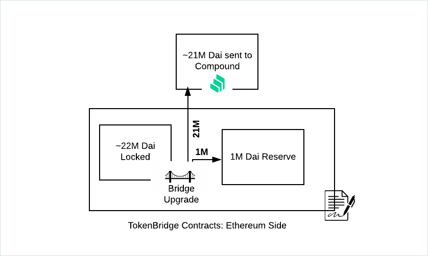

# Dai & Stable Coin Compounding

_Updated October 25, 2021_

## Compounding

The latest TokenBridge upgrades include the ability to allocate Dai locked in the TokenBridge contract to the [Compound interest rate market](https://compound.finance) and Stable Coins (USDC & USDT) locked in the OmniBridge contract to the[ Aave interest market](https://app.aave.com/markets). Locked funds will accumulate interest as well as COMP and AAVE tokens. These funds can then be used to support bridge operations.

\-> [Compounding Analytics now available on on Dune](https://dune.xyz/maxaleks/Compounding-in-xDai-bridges)

The following describes the process for the xDai bridge. At the end of the document are caveats related to the OmniBridge, where parameters differ slightly.

### Initial Mechanisms

1. As a part of the bridge upgrade, an amount of locked Dai ([_`Current Amount Locked(~22M)`_](https://etherscan.io/token/0x6b175474e89094c44da98b954eedeac495271d0f?a=0x4aa42145aa6ebf72e164c9bbc74fbd3788045016)_ `-` `1,000,000 Dai`_) is transferred to Compound.
2. 1,000,000 Dai remains in the bridge contract as a reserve supporting daily operations.

### User Actions

1. **Dai bridged from Ethereum to xDai:** Following the upgrade, any amount of Dai bridged from Ethereum to xDai** **is added to the bridge reserve. It is not automatically transferred to Compound.
2. **xDai bridged from xDai to Ethereum:** Bridge requests from xDai to Ethereum use the Dai in the reserve. If a request is initiated that exceeds the available reserve amount, the requested amount exceeding the reserve + 1,000,000 Dai (required reserve) is withdrawn immediately from Compound. The 1,000,000 Dai replenishes the reserve. \
   `if current_reserve < requested `\
   `withdraw requested - current_reserve + required_reserve`

.png>)

### Interest & Funds

1. Interest on the Dai supplied to Compound and COMP tokens will be collected periodically (approximately monthly) and transferred to an EOA through a manual method call. Funds will be used to support bridge operations such as gas refunds for users or other tbd mechanisms which can be discussed and decided on by the bridge governors.
2. Once the reserve reaches a significantly higher amount than what is required for daily operations, bridge governors can decide to send this excess amount to Compound.

### Upgradability / Governance

1. Bridge governors can vote to turn off the compounding mechanism at any time. If turned off, all Dai tokens will be returned to the bridge contract.
2. Bridge governors can vote to change the interest receiving address if required (currently must be an EOA or a contract supporting the [`onInterestReceived`](https://github.com/poanetwork/tokenbridge-contracts/blob/master/contracts/interfaces/IInterestReceiver.sol) method).

### Risks

1. An unlikely scenario can arise where the amount of Dai requested for withdrawal is not available on Compound (due to high borrowing demand). In this case, a user will need to wait until Compound liquidity is available to execute the request.&#x20;
2. Compound protocol is a trusted entity. If compromised the protocol could attack the contracts in various ways, e.g., through reentrancy or by simply stealing funds.&#x20;


Note: TVL metrics displayed in sources such as [DeFiLama ](https://defillama.com/protocol/xdai-stake)and [DeFiPulse](https://defipulse.com/xdai) may reflect different values once Dai is sent to Compound.&#x20;

Compound metrics are available in the [xDai Bridge Dune Analytics Dashboard](dai-compounding.md#compounding) to reflect current invested amount as well as locked reserve amount.


### OmniBridge Upgrade

The OmniBridge upgrade utilizes similar mechanics as above to earn interest on USDC and USDT locked in the OmniBridge. The primary difference is the utilization of Aave rather than Compound for interest accumulation. Additional protocol differences correspond to the initial amount allocated to the reserves (USDC 2.5M reserve, USDT 750K reserve).

1. **USDC**:  ([_`Current Amount Locked(~46M)`_](https://etherscan.io/token/0xa0b86991c6218b36c1d19d4a2e9eb0ce3606eb48?a=0x88ad09518695c6c3712ac10a214be5109a655671)_ `-` `2,500,000 USDC`_) transferred to Aave. 2.5M for initial reserve.
2. **USDT**:  ([_`Current Amount Locked(~5.6M)`_](https://etherscan.io/token/0xdac17f958d2ee523a2206206994597c13d831ec7?a=0x88ad09518695c6c3712ac10a214be5109a655671)_ `-` `750,000 USDT`_) transferred to Aave. 750K for initial reserve.

To complete this update, any tokens locked in the Omnibridge were automatically released back to Ethereum and paid for by the team. This is the 2nd prior pending claims amnesty conducted by the team, [the first is described here](https://www.xdaichain.com/about-xdai/news-and-information/project-updates/2021-weekly-updates/xdai-weekly-recap-28-05-2021#prior-pending-claims-amnesty).

In addition, USDT & USDC can now be bridged from xDai -> Eth with 0 additional fees (previously there was a 1% fee). Users must still pay for gas prices on Ethereum to process the transaction, but there are no fees beyond paying for gas.

### Resources:

Compounding functionality recently underwent a [thorough security audit from ChainSecurity](../../../for-developers/security-audits.md#omnibridge-audit-by-chainsecurity-1).

* **TokenBridge contracts**: [https://github.com/poanetwork/tokenbridge-contracts/tree/master/contracts/upgradeable\_contracts](https://github.com/poanetwork/tokenbridge-contracts/tree/master/contracts/upgradeable\_contracts)
* **OmniBridge contracts**: [ https://github.com/omni/omnibridge/tree/master/contracts/upgradeable\_contracts](https://github.com/omni/omnibridge/tree/master/contracts/upgradeable\_contracts)

