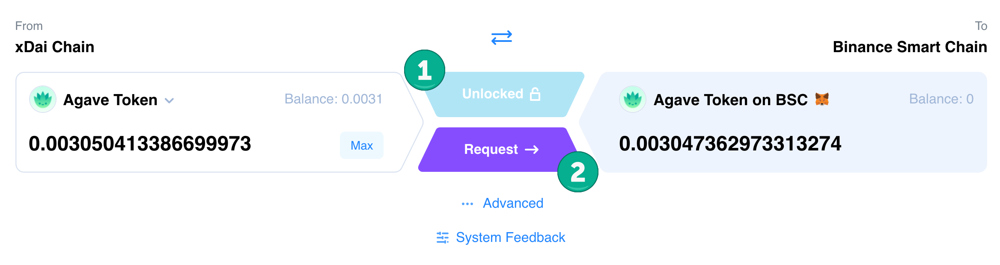

# Reverse Bridging

Tokens minted natively on xDai are now available to bridge to other destination chains, including Ethereum, BSC and POA. Note that you will need to pay gas costs for the destination chain (which can be quite high for Ethereum) with the destination currency (such as ETH or BSC) when bridging.

**Bridging requires 2 steps:**

1. Unlock the Token (allow the application to transfer)
2. Request the Transfer (requires 2 transactions, 1 from sending chain and a second on destination chain to claim)

See this [OmniBridge tutorial to learn more](https://honeyswap.org/xdai-bridges)

