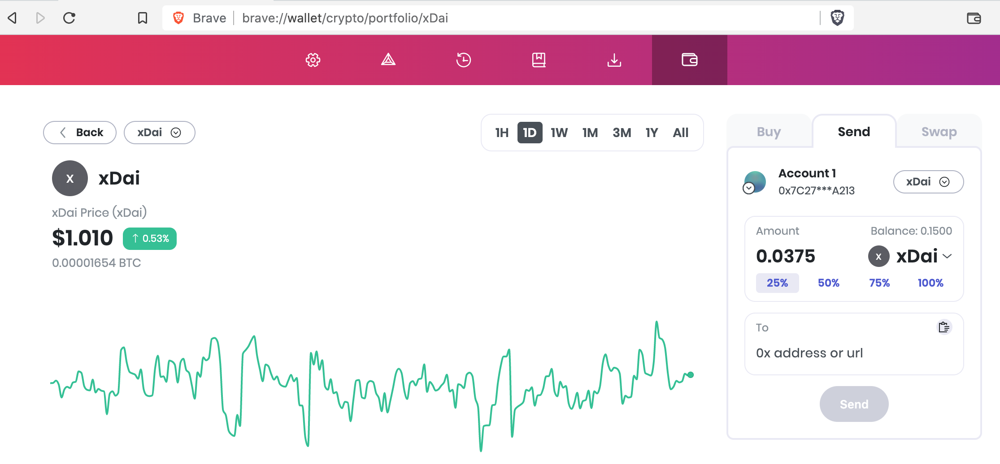
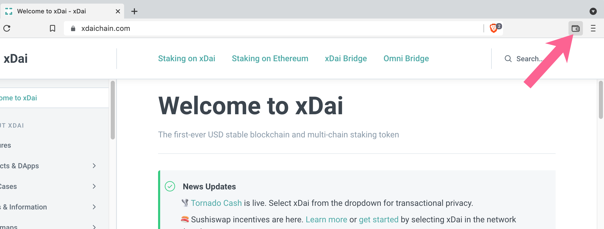
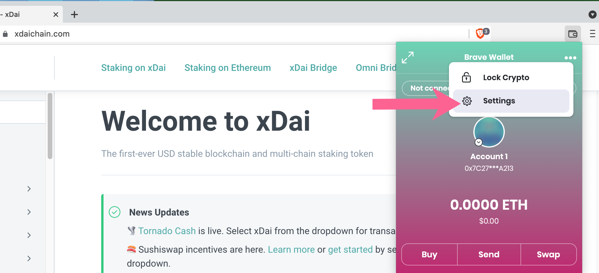
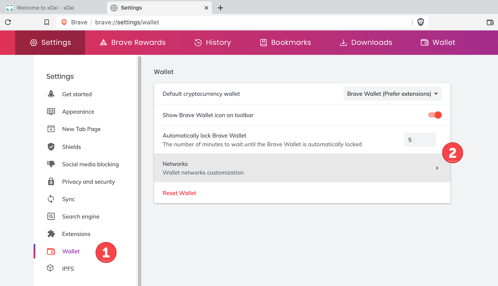
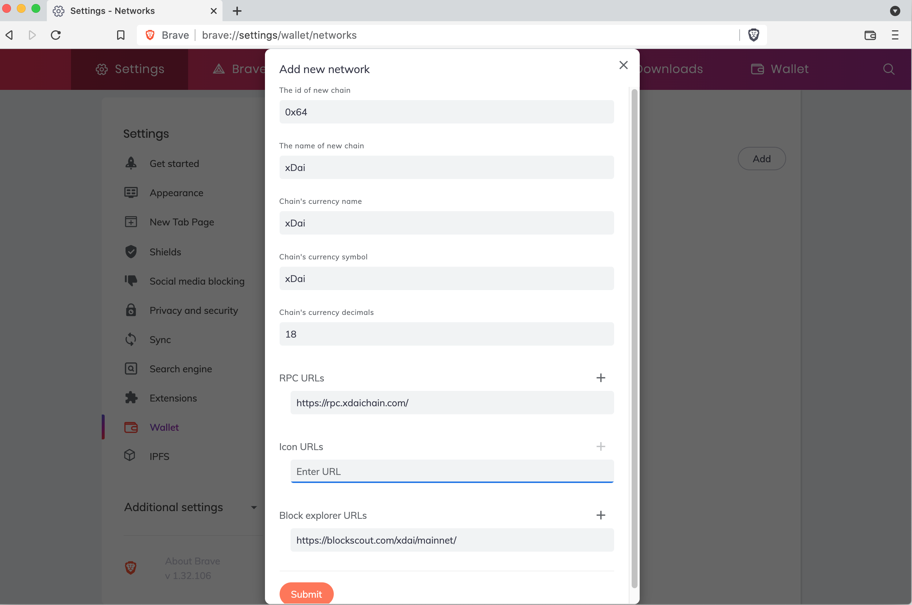

# Brave Native

Brave Browser now ships with a native wallet which is easily configured to add the xDai network.

#### 1) To start, download the latest version of [Brave browser](https://brave.com). Click on the wallet icon to configure your wallet, either by creating a new wallet or importing an existing wallet from MetaMask, Ledger, Trezor or others.

#### 2) Once Configured, Go to Settings to add a new network.

#### 3) In Wallet Settings, select Network

#### 4) Fill in xDai Network Details and click Submit

#### 5) You can now use xDai for wallet interaction with Brave! Note you cannot yet Buy or Swap tokens, but you can use the xDai chain for web3 and DApp interactions.

